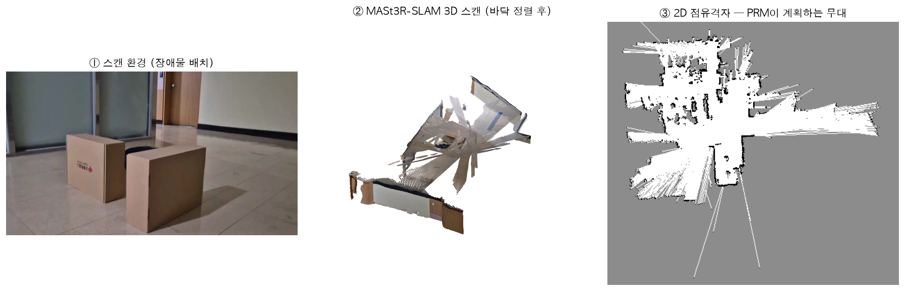
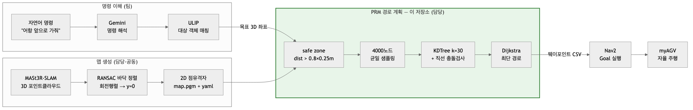
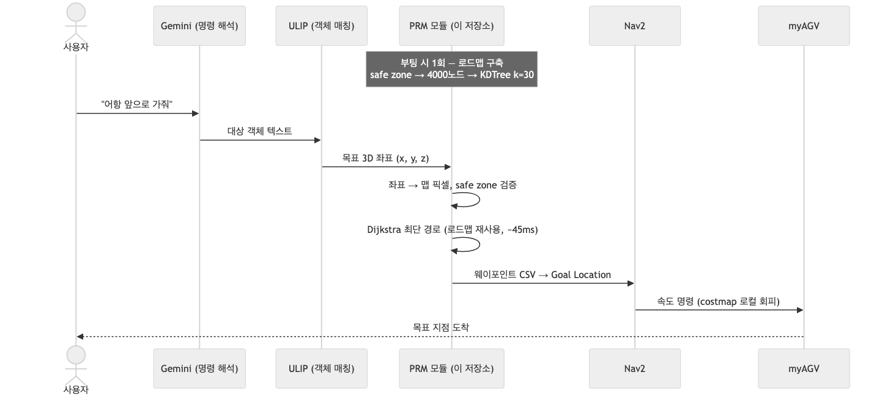
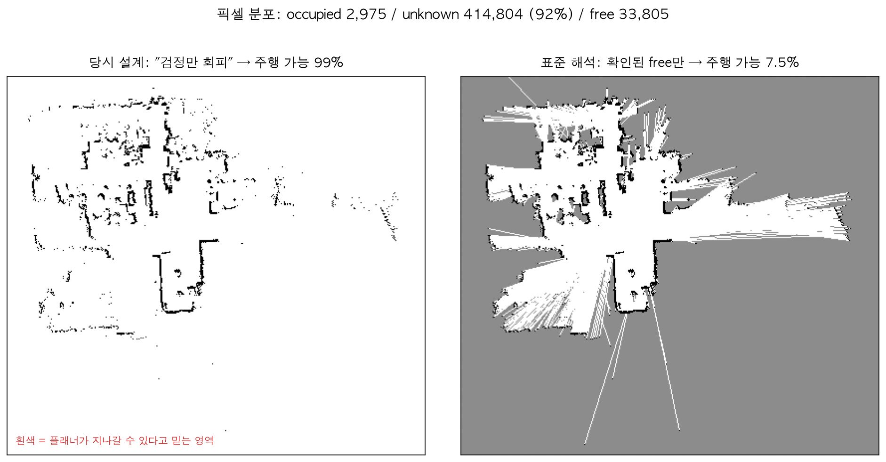
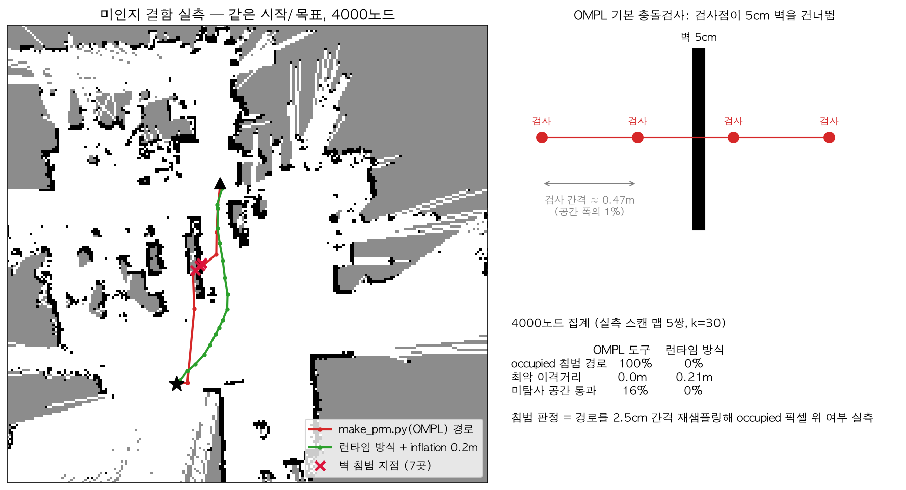
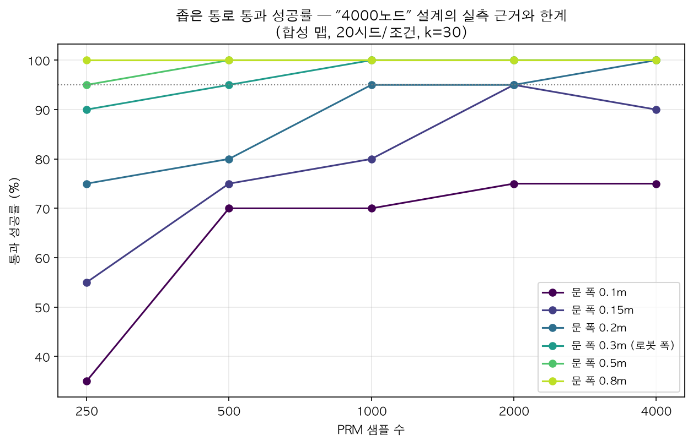
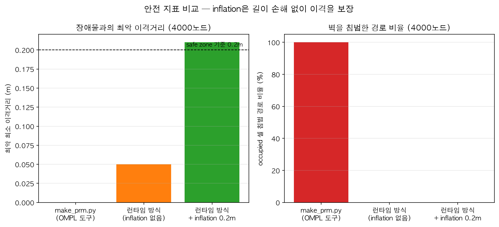
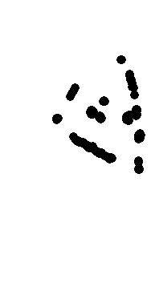
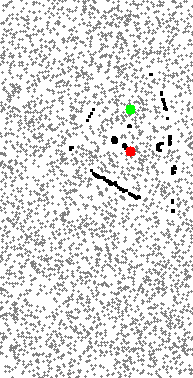
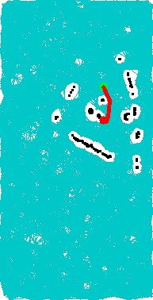

# myagv-nav2-prm: 양식장 로봇의 PRM 경로 계획

종합설계 SRCP(스마트 양식장 디지털 트윈 로봇 제어 플랫폼, 2025)의 경로 계획 파트입니다.
"어항 앞으로 가줘" 같은 자연어 명령이 들어오면, SLAM으로 스캔한 맵 위에서 안전한 경로를 계산해 myAGV가 자율 주행하는 시스템에서, 목표 좌표 이후의 경로 계획 구간을 담당했습니다. 실제 양식장 배포까지는 가지 못했고, 양식장의 장애물 배치를 모사한 실내 환경에서 스캔·주행을 검증했습니다.

> 역할: 3D→2D 점유격자 변환, PRM 경로 계획(런타임 모듈), 안전 마진 설계 — [FishFarm Robotics](https://github.com/FishFarm-robotics) 팀의 백동민 담당 파트



<p align="center"><sub>스캔 환경(장애물 배치) → MASt3R-SLAM 3D 복원 → 이 저장소의 2D 점유격자(<code>map/map.pgm</code>). 사진의 박스 두 개가 스캔과 맵에서 그대로 식별됩니다.</sub></p>

## 파이프라인



목표 3D 좌표와 2D 점유격자를 입력으로 받아 Nav2가 실행할 웨이포인트를 출력하는 흐름입니다. 초록 박스가 이 저장소의 범위입니다.

## 시스템에서의 위치

전체 시스템은 명령 이해(Gemini·ULIP), 경로 계획(이 저장소), 실행(Nav2·myAGV)으로 나뉩니다. 로드맵은 부팅 시 한 번만 구축하고, 이후 명령마다 시작/목표만 바꿔 재질의합니다 — PRM을 선택한 이유가 이 구조에 있습니다.



## 문제 상황

양식장은 수조·배관·장비로 장애물이 복잡하게 배치된 환경이고, 로봇(myAGV)의 연산 자원은 제한적이었습니다. 여기서 세 가지 문제가 있었습니다.

1. **반복 질의**: 자연어 명령이 계속 들어오므로 매번 처음부터 경로를 탐색하면 낭비가 큽니다. 환경은 고정이므로 로드맵을 한 번 만들어 재사용하는 PRM이 RRT보다 유리했습니다.
2. **좁은 통로 vs 연산량**: 샘플이 적으면 수조 사이 좁은 통로를 놓치고, 많으면 KNN·충돌검사 비용이 커집니다. 로봇 CPU 제약 안에서 커버리지를 확보할 샘플 수와 이웃 수(k)를 정해야 했습니다.
3. **로봇은 점이 아님**: 맵상 통과 가능해 보여도 로봇이 끼이는 상황을 구조적으로 막아야 했습니다.

## 해결 방법

런타임 모듈(`scripts/prm_rviz.py`, 2025-05 원본 그대로 보존)의 구성:

1. **Safe zone**: distance transform으로 픽셀별 장애물 거리를 계산해 `dist > 0.8 × robot_radius(0.25m)`인 영역만 주행 후보로 삼았습니다. 장애물 팽창(erode)보다 정교하고, 로봇 크기가 바뀌면 상수 하나만 조정하면 됩니다.
2. **로드맵 구축**: safe zone 안에 4000개 노드를 균일 샘플링하고, scipy KDTree로 k=30 최근접 이웃을 찾아 직선 충돌검사(LineFree)를 통과한 엣지만 연결했습니다. k를 경험칙(k≈log n≈8)보다 크게 잡은 것은 좁은 통로 연결성을 우선했기 때문입니다.
3. **탐색과 출력**: Dijkstra 최단경로(4000노드 규모에선 A* 휴리스틱이 불필요) → 맵↔세계 좌표 변환 → 웨이포인트 CSV 출력 → Nav2 Goal. 디버깅용으로 safe zone/샘플/연결/경로 4단계 시각화도 만들었습니다(`docs/figures/original_2025/`).

별도로 OMPL 기반 오프라인 도구 `scripts/make_prm.py`도 작성했습니다 — 맵만 있으면 ROS 없이 경로를 뽑아보는 용도입니다.

### 참고한 것

- PRM (Kavraki et al. 1996): 정적 환경에서 로드맵을 재사용하는 표준 샘플링 기반 계획법.
- [OMPL](https://ompl.kavrakilab.org/): 오프라인 도구의 PRM 구현에 사용.
- Nav2 costmap inflation layer: 안전 마진 설계의 참조 모델.

## 실험과 검증

만든 방법이 실제로 맞는 선택이었는지 1년 뒤(2026-07) ground-truth 실험으로 스스로 검증했습니다. 기준선은 8-연결 A*(사실상 최적)이고, 관통 판정은 경로를 2.5cm 간격으로 재샘플링해 occupied 픽셀 위 여부를 직접 셉니다.

| 실험 | 파일 | 핵심 결과 |
| --- | --- | --- |
| 샘플 수 스윕 (실제 맵 5쌍) | `experiments/exp_a1_samples_sweep.py` | 성공률·이격거리·계획시간 CSV |
| 좁은 통로 합성 맵 | `experiments/exp_a2_narrow_passage.py` | 문 폭 × 샘플 수 → 성공률 |
| 안전 지표 집계 | `experiments/exp_a3_safety_margin.csv` | 플래너별 이격거리·침범율 |

정직한 결론은 다음과 같습니다.

- **4000노드·k=30 설계는 실측으로 뒷받침됩니다.** 로봇 폭(0.3m) 통로는 1000노드부터 성공률 100%이고, 4000노드는 여유분입니다. k=10이었다면 같은 통로에서 95%에 그칩니다. 계획 시간은 45ms(macOS 참고치)로 실시간권입니다.
- **극단적으로 좁은 통로(0.1m)는 4000노드로도 75%.** 균일 샘플링의 구조적 한계이고, bridge/Gaussian sampling이 개선 방향입니다.
- **safe zone(inflation)은 길이 손해 없이 안전을 보장합니다.** 미적용 시 최악 이격 0.05m(맵 1픽셀, 사실상 충돌) → 적용 시 항상 0.21m 이상.
- **"검정(occupied)만 회피" 단순화의 비용을 정량화했습니다.** 당시 unknown(맵의 92%)을 주행 가능으로 취급한 것은 스캔된 방 안에서만 동작하는 시연 환경을 전제로 한 의도된 결정이었습니다. 실측 결과 경로의 평균 16%가 미탐사 영역을 지나갑니다 — 일반 환경이라면 strict 해석 + unknown 별도 비용(Nav2 costmap 방식)이 맞습니다.
- **몰랐던 결함도 찾았습니다.** OMPL 오프라인 도구(`make_prm.py`)는 기본 충돌검사 간격(공간 폭의 1% ≈ 0.47m)이 벽 두께(5cm)보다 거칠어 검사점이 벽을 건너뜁니다. 실측에서 경로의 100%가 occupied 셀을 침범했습니다. 실기기에서 사고가 없었던 것은 Nav2 costmap이 로컬에서 보완했기 때문입니다 — 이 도구를 단독으로 쓰면 위험합니다.

아래는 실험 결과 차트입니다. 모두 `experiments/`의 CSV에서 나온 것이며, 생성 코드는 `docs/figures/make_figures.py`에 있습니다.



"검정만 회피" 설계가 실제로 의미하는 것. 왼쪽이 당시 플래너가 주행 가능하다고 믿은 영역(99%), 오른쪽이 스캔으로 확인된 free(7.5%)입니다.



OMPL 도구의 충돌검사 터널링 실측. 같은 시작/목표에서 OMPL 경로(빨강)는 벽을 관통하고, 런타임 방식 + inflation(초록)은 우회합니다.



문 폭별 통과 성공률. 로봇 폭(0.3m) 통로는 1000노드부터 100%, 0.1m 극단만 한계가 남습니다. (`experiments/exp_a2_narrow_passage.csv`)



안전 지표 비교. inflation이 이격 ≥0.21m를 보장하고, 경로 길이 불이익은 측정상 유의미하지 않습니다. (`experiments/exp_a3_safety_margin.csv`)

### 당시 개발 산출물 (2025-05)

런타임 모듈이 개발 당시 생성한 단계별 시각화입니다 (`docs/figures/original_2025/`).

| safe zone | 샘플링 | 경로 |
| --- | --- | --- |
|  |  |  |

## 저장소 구조

```
myagv-nav2-prm/
├── scripts/
│   ├── prm_rviz.py              # 런타임 PRM 모듈 (2025-05 원본: safe zone, 4000노드, KDTree k=30, Dijkstra, CSV 출력)
│   ├── make_prm.py              # OMPL 기반 오프라인 PRM 도구 (충돌검사 터널링 결함 있음 — 실험과 검증 참조)
│   ├── make_nav2_path.py        # Nav2 ComputePathToPose 비교용
│   ├── prm_path_publisher.py    # 저장된 경로를 nav_msgs/Path로 발행 (RViz)
│   └── ply_publisher.py         # .ply → PointCloud2 스트리밍
├── launch/, param/, rviz/       # Nav2 bringup (myAGV 튜닝)
├── map/                         # 실측 MASt3R-SLAM 스캔 맵 — 양식장 모사 실내 환경 (.pgm + .yaml)
├── experiments/                 # 2026-07 ground-truth 재현 실험
│   ├── planners.py              # A* GT, 자체 PRM 재구현, OMPL 포팅, 경로 품질 지표
│   ├── exp_a1_samples_sweep.py  # 실제 맵 샘플 수 스윕
│   ├── exp_a2_narrow_passage.py # 좁은 통로 합성 맵
│   └── *.csv                    # 실험 결과
└── docs/
    ├── figures/                 # 결과 차트 + 생성 스크립트(make_figures.py) + 2025-05 원본 시각화
    └── diagrams/                # 파이프라인·시스템 시퀀스 (mermaid .mmd + png)
```

## 실행

재현 실험은 카메라·로봇·ROS 없이 돌아갑니다.

```bash
pip install numpy scipy opencv-python pyyaml matplotlib ompl
python experiments/exp_a1_samples_sweep.py    # 실제 맵 스윕 (~2분)
python experiments/exp_a2_narrow_passage.py   # 좁은 통로 (~1분)
python docs/figures/make_figures.py           # 차트 재생성
```

`ompl`이 설치되지 않으면 OMPL 비교(repo_ompl)만 빠지고 나머지는 동작합니다. pip ompl은 현행 pybind 바인딩이라 `make_prm.py` 원본(구형 Py++ 바인딩 대상)은 그대로 실행되지 않습니다 — `experiments/planners.py`의 `repo_plan()`이 로직 동일·API만 치환한 포팅입니다.

실기기 파이프라인은 ROS 2 + `nav2_bringup`이 필요합니다.

```bash
colcon build --packages-select myagv_navigation2
source install/setup.bash
ros2 launch myagv_navigation2 navigation2_active.launch.py
```

`prm_rviz.py`는 2025-05 개발 당시 원본을 그대로 보존한 것이라 로컬 경로가 하드코딩되어 있습니다.
